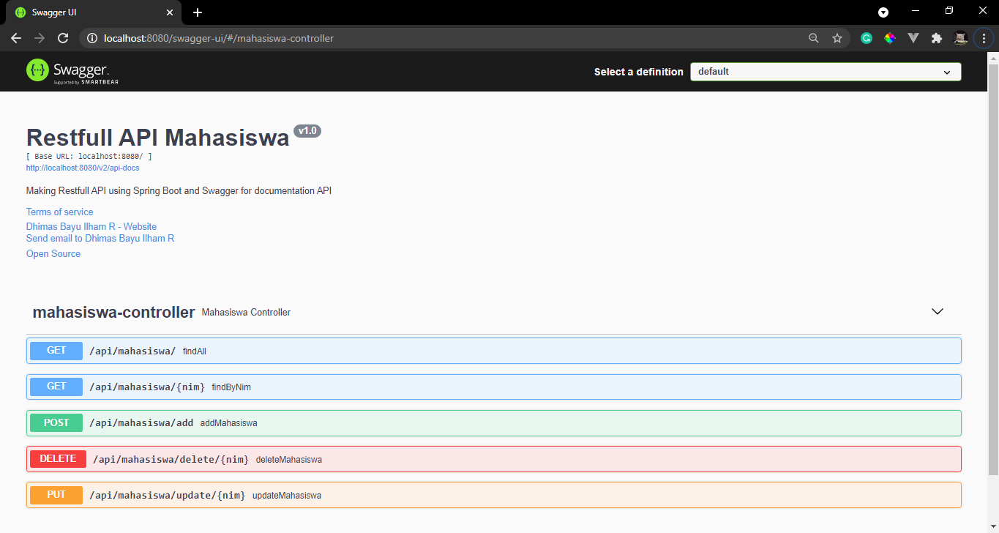
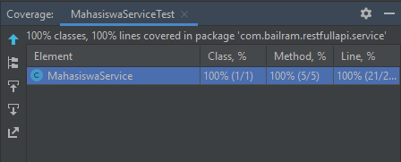
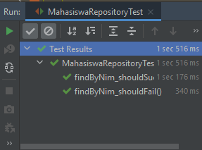

# Restfull API Spring Boot
Making Restfull API using Spring Boot and Swagger for documentation API

### Screenshot
localhost:8080/restfullapi/swagger-ui/#/mahasiswa-controller <br>
 <br>
Unit test with coverage result <br>
 

### H2 Setup for unit test
application.properties on (restfullapi/src/test/resources/application.properties)
```properties
spring.datasource.url=jdbc:h2:mem:testdb;DB_CLOSE_DELAY=-1
spring.datasource.driverClassName=org.h2.Driver
spring.datasource.username=sa
spring.datasource.password=
```
Don't forget to add annotation @DataJpaTest on top the test class. example :
```java
@DataJpaTest
class MahasiswaRepositoryTest {
    ...
}
```

example unit test for repository checkout this file :
[MahasiswaRepositoryTest.java](https://spring.io/guides/tutorials/rest/) <br>

Screenshot<br>
<br>

### Note
To check out the documentation for the restfull api using spring boot and swagger just visit the link down below<br>g
localhost:8080/restfullapi/swagger-ui/<br>
Don't forget to adding slash after swagger-ui<br>

### Source
[Building REST service with Spring](https://spring.io/guides/tutorials/rest/) <br>