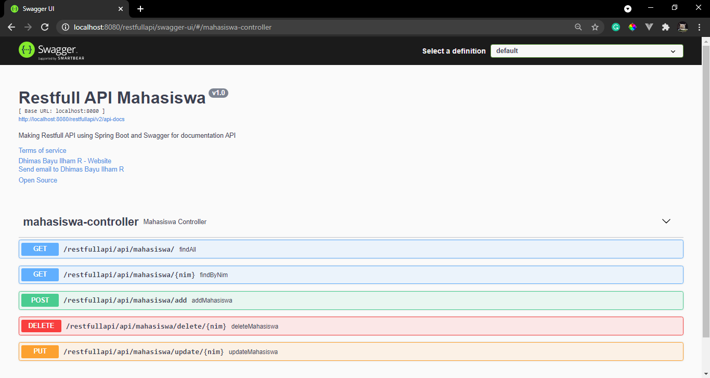

# Restfull API Spring Boot
Making Restfull API using Spring Boot and Swagger for documentation API

### Screenshot
localhost:8080/swagger-ui/#/mahasiswa-controller
  
Unit test with coverage result
 

### Note
To check out the documentation for the rest template covid 19 API using swagger UI just visit the link down below 
localhost:8080/swagger-ui/ 
Don't forget to adding slash after swagger-ui 

### Source
[Building REST service with Spring](https://spring.io/guides/tutorials/rest/)  